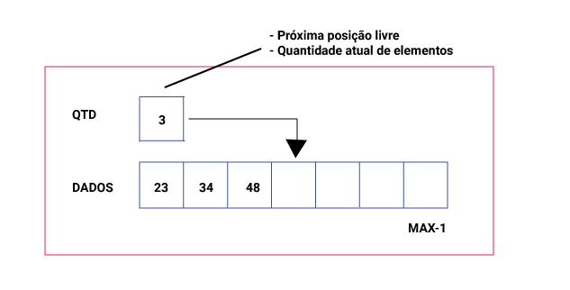
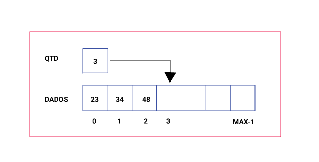
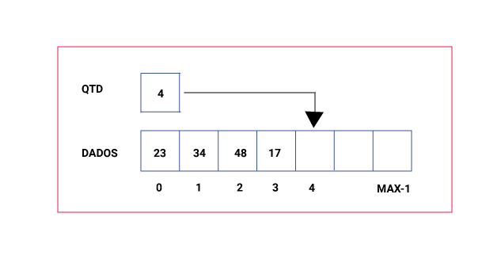
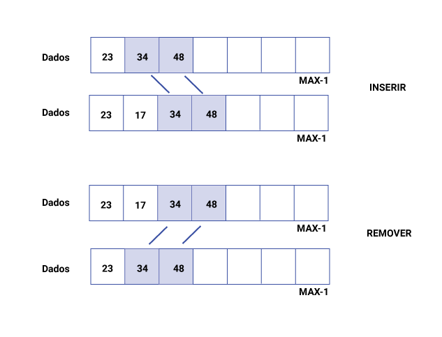

# [ED] Aula 04 - Listas Parte 2 - Lista Estática Sequencial
https://www.youtube.com/watch?v=rxVrRdF0MTE

Todos os créditos para **Linguagem C Programação Descomplicada**
https://www.youtube.com/channel/UCUc6UwvpQfOLDE7e52-OCMw

Tipo de 'Lista' onde o sucessor de um elemento ocupa a posição física seguinte do mesmo (uso de 'array' ou vetor)

## Vantagens do uso de arrays:
- Acesso rápido e direto aos elementos (índice)
- Tempo  constante para acessar um elemento
- Facilidade em modificar informações

Ao adicionarmos um elemento à lista, basta colocarmos na próxima posição vaga.

## Desvantagens do uso de arrays:
- Definição prévia do tamanho do array
- Dificuldade para inserir e remover um elemento entre outros dois: é necessário deslocar os elementos

## Quando utilizar essa 'lista'?
- Listas Pequenas
- Inserçãoremoção apenas no final da lista
- Tamanho máximo bem definido
- A busca é a operação mais frequente