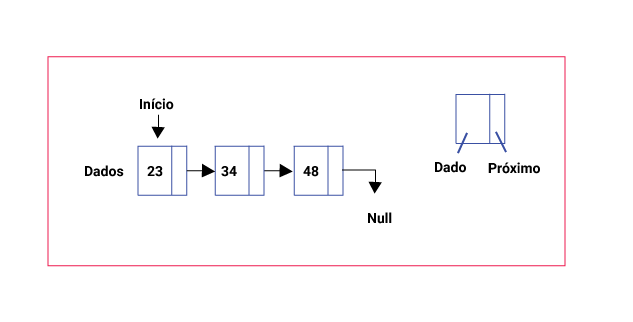

# [ED] Aula 03 - Listas Parte 1 - Definição
https://www.youtube.com/watch?v=S6rOYN-UiAA

Todos os créditos para **Linguagem C Programação Descomplicada**
https://www.youtube.com/channel/UCUc6UwvpQfOLDE7e52-OCMw

Uma estrutura do tipo 'lista' é uma sequência de elementos do mesmo tipo. Seus elementos possuem estrutura interna abstraída, ou seja, sua complexidade é arbitrátia e não afeta o seu funcionamento.

Uma 'lista' pode possuir N (N>=0) elementos.
Se N = 0, dizemos que a lista está vazia.

## Aplicações:
- Cadastro de funcionários
- Itens em estoque
- Cartas em baralho
- Etc

## Podemos realizar as seguintes operações
- Criação da lista
- Inserção de elementos
- Exclusão de elementos
- Acesso de elementos
- Destruição da lista
- Etc

### Essas operações dependem do tipo de alocação de memória usada
- Estática
- Dinâmica

## Alocação estática (Vetor)
- O espaço de memória é alocada no momento da compilação
- Exige a definição do número máximo de elementos da "lista"
- Acesso sequencial: elementos consecutivos na memória

## Alocação dinâmica
- O espaço de memória é alocado em tempo de execuação.
- A 'lista' cresce à medidade que novos elementos são armazenados, e diminui à medida que elementos são removidos
- Acesso encadeado: cada elemento pode estar em uma área distinta da memória. Para acessar um elemento é preciso percorrer todos os seus antecessores na 'lista'.

[A Seguir - Lista Sequencial Estática](./Lista_Sequencial_Estatica.md)